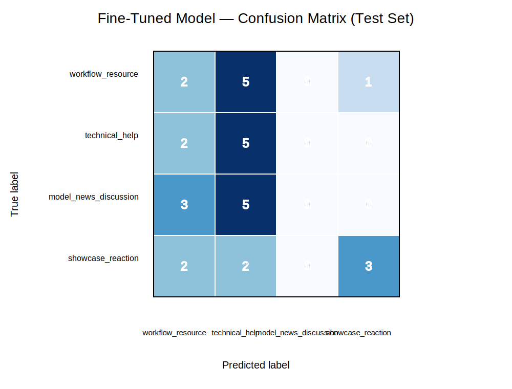

# TakeMeter: Classifying Generative AI Creator Discourse

## Overview

TakeMeter is a text classification project for AI201 Project 3. The goal is to classify public r/StableDiffusion posts and comments into discourse categories that reflect how people participate in a generative AI creator community.

This project focuses on the difference between reusable creator knowledge, technical troubleshooting, model/news discussion, and low-context showcase or reaction content. The motivation is practical: AI creator communities contain a lot of useful workflow knowledge, but that signal is mixed with hype, memes, brief reactions, and ambiguous posts. A classifier like this could help surface useful workflows, identify technical pain points, and track discussion around new models or tooling.

## Community

The dataset uses public examples from r/StableDiffusion, a Reddit community focused on Stable Diffusion, ComfyUI, open-source/local AI image generation, model releases, workflows, and related creator tools.

I chose this community because it connects directly to generative AI creator workflows and AI content creation. The community has several recurring types of discourse: people share workflows, ask for technical help, discuss new models and licensing, and post showcases or reactions.

## Labels

I used four mutually exclusive labels.

| Label | Definition |
|---|---|
| `workflow_resource` | The text shares a repeatable creator process, prompt strategy, model setup, ComfyUI workflow, LoRA, checkpoint, tutorial, benchmark, tool, resource, or practical method that another creator could use, reproduce, download, or adapt. |
| `technical_help` | The text asks for help, troubleshooting, recommendations, settings, installation support, hardware guidance, error diagnosis, or explains a technical problem. |
| `model_news_discussion` | The text discusses model releases, tool updates, model comparisons, licensing, commercial use, platform rules, copyright, AI art debates, or broader community/tooling implications. |
| `showcase_reaction` | The text is mainly an image/video showcase, hype, joke, meme, praise, vague criticism, emotional reaction, or low-detail comment without a clear reusable workflow, technical problem, or substantive model/news discussion. |

## Label Examples

| Example text | Label |
|---|---|
| "I made a visual Ideogram 4 prompt editor with JSON generation by LLM and vision." | `workflow_resource` |
| "What models and workflows can generate an image in 5s?" | `technical_help` |
| "Ideogram 4 is a great model, but the license is very restrictive." | `model_news_discussion` |
| "It is still nuts to me how realistic AI is getting." | `showcase_reaction` |

## Dataset

The dataset is stored in `data/labeled_data.csv`.

It contains 200 total examples with two required columns:

```text
text,label
```

The label distribution is balanced:

| Label | Count |
|---|---:|
| `workflow_resource` | 50 |
| `technical_help` | 50 |
| `model_news_discussion` | 50 |
| `showcase_reaction` | 50 |

I intentionally kept the classes balanced so that the model would not learn to predict only the majority class.

## Data Collection and Annotation Process

I collected public text examples from r/StableDiffusion posts and comments. I did not include usernames, private messages, or personal metadata. Each row was labeled according to the main purpose of the text.

The hardest part was deciding how to label short or title-like examples. Many posts in AI creator communities are short, and a title such as "Ideogram 4 Turbo LoRA Released" can look like both a resource and model news. To handle this, I used decision rules:

- If the text gives reusable setup or workflow information, label it `workflow_resource`.
- If the text asks how to solve or configure something, label it `technical_help`.
- If the text is mainly about a model/tool release, license, commercial use, or broader community issue, label it `model_news_discussion`.
- If the text is mostly a reaction, showcase, joke, or hype statement, label it `showcase_reaction`.

## Model and Training Setup

The fine-tuned model used was:

```text
distilbert-base-uncased
```

The dataset was split approximately as:

- 70% training
- 15% validation
- 15% test

The final test set contained 30 examples.

The training setup used the starter Colab notebook with default hyperparameters:

| Hyperparameter | Value |
|---|---:|
| Epochs | 3 |
| Learning rate | 2e-5 |
| Train batch size | 16 |
| Eval batch size | 32 |
| Weight decay | 0.01 |
| Model | `distilbert-base-uncased` |

## Baseline Model

The baseline was a zero-shot Groq/Llama classifier. The prompt included the community description, the four label definitions, examples for each label, and decision rules. The model was instructed to return only one valid label name.

The baseline was evaluated on the same 30-example test set as the fine-tuned DistilBERT model.

## Results

| Model | Accuracy |
|---|---:|
| Zero-shot baseline (Groq/Llama) | 0.7333 |
| Fine-tuned DistilBERT | 0.3333 |

Fine-tuning did not improve performance. It caused a regression of 0.4000 accuracy compared with the zero-shot baseline.

The exported metrics are in `evaluation_results.json`.

## Fine-Tuned Model Per-Class Metrics

| Label | Precision | Recall | F1-score | Support |
|---|---:|---:|---:|---:|
| `workflow_resource` | 0.22 | 0.25 | 0.24 | 8 |
| `technical_help` | 0.29 | 0.71 | 0.42 | 7 |
| `model_news_discussion` | 0.00 | 0.00 | 0.00 | 8 |
| `showcase_reaction` | 0.75 | 0.43 | 0.55 | 7 |
| **Accuracy** |  |  | **0.33** | 30 |
| **Macro avg** | 0.32 | 0.35 | 0.30 | 30 |
| **Weighted avg** | 0.30 | 0.33 | 0.29 | 30 |

## Baseline Per-Class Metrics

| Label | Precision | Recall | F1-score | Support |
|---|---:|---:|---:|---:|
| `workflow_resource` | 0.78 | 0.88 | 0.82 | 8 |
| `technical_help` | 0.70 | 1.00 | 0.82 | 7 |
| `model_news_discussion` | 1.00 | 0.38 | 0.55 | 8 |
| `showcase_reaction` | 0.62 | 0.71 | 0.67 | 7 |
| **Accuracy** |  |  | **0.73** | 30 |
| **Macro avg** | 0.78 | 0.74 | 0.71 | 30 |
| **Weighted avg** | 0.78 | 0.73 | 0.71 | 30 |

## Confusion Matrix

The confusion matrix below shows the fine-tuned DistilBERT model's predictions on the test set.



The most important pattern is that the fine-tuned model never correctly predicted `model_news_discussion`. It also over-predicted `technical_help`, especially for true `workflow_resource` and `model_news_discussion` examples.

## Error Analysis

The fine-tuned DistilBERT model made 20 incorrect predictions out of 30 test examples. Many errors came from short examples where the text did not contain enough context for a small fine-tuned model to infer the label boundary.

### Failure 1

Text:

```text
I made a visual Ideogram 4 prompt editor with JSON generation by LLM and vision.
```

True label: `workflow_resource`  
Predicted label: `technical_help`

Analysis: The example describes a tool/resource, but the model likely focused on technical words like "prompt editor," "JSON," and "LLM," which often appear in help requests. The model did not learn the difference between sharing a tool and asking for help with a tool.

### Failure 2

Text:

```text
I'm looking for local models and workflows that can generate images in under five seconds on average CPU.
```

True label: `technical_help`  
Predicted label: `workflow_resource`

Analysis: The text asks for a recommendation, so it should be `technical_help`. The model likely focused on the words "models" and "workflows," which are common in resource-sharing examples.

### Failure 3

Text:

```text
Replies to the Monet post were confidently wrong about whether it was AI.
```

True label: `model_news_discussion`  
Predicted label: `workflow_resource`

Analysis: This is a broader AI art/community discussion, but it lacks obvious keywords like "license," "release," or "model." The model had trouble recognizing community discourse when it did not contain explicit model-news vocabulary.

### Failure 4

Text:

```text
Ideogram 4 can produce great stuff sometimes.
```

True label: `showcase_reaction`  
Predicted label: `workflow_resource`

Analysis: The text is a vague reaction to model output. The model may have over-associated the model name "Ideogram 4" with workflow/resource content.

### Failure 5

Text:

```text
Subject first, then style, then scene, with lighting and camera last.
```

True label: `workflow_resource`  
Predicted label: `showcase_reaction`

Analysis: This is a practical prompt-ordering rule, so it is a workflow/resource example. However, because it is short and lacks explicit words like "workflow," "tutorial," or "settings," the model treated it as a low-context reaction.

## What the Model Learned vs. What I Intended

I intended the fine-tuned model to learn discourse intent: whether a post was sharing reusable creator knowledge, asking for technical help, discussing broader model/community issues, or simply reacting/showcasing.

The fine-tuned model learned some surface-level distinctions but did not learn the full taxonomy. It became especially biased toward `technical_help` and failed completely on `model_news_discussion`. The confidence scores for many wrong predictions were around 0.26 to 0.28, which is close to random uncertainty for a four-class classifier. This suggests the model was not strongly separating the categories.

The zero-shot baseline performed much better because it could use the full written label definitions and general language reasoning at inference time. The baseline could interpret subtle intent better than a small model fine-tuned on only 200 short examples.

## Why Fine-Tuning Underperformed

There are several likely causes:

1. **Small dataset size**: 200 examples is enough for a course project, but it is small for learning subtle discourse boundaries.
2. **Short text examples**: Many examples were titles or short comments. They often lacked enough context for DistilBERT to infer intent.
3. **Overlapping labels**: `workflow_resource`, `technical_help`, and `model_news_discussion` all contain model/tool/workflow vocabulary.
4. **Weak context for model news**: `model_news_discussion` sometimes required broader community context that was not obvious from the text alone.
5. **Strong baseline**: The Groq/Llama baseline had access to detailed label definitions and stronger general reasoning.

## Sample Classification Table

| Text | True Label | Fine-tuned Prediction | Result |
|---|---|---|---|
| "ComfyUI keeps failing when a checkpoint loads; is this VRAM or a missing custom node?" | `technical_help` | `technical_help` | Correct |
| "Anima-Base is magic and I don't think people realize how good it is." | `showcase_reaction` | `showcase_reaction` | Correct |
| "I made a visual Ideogram 4 prompt editor with JSON generation by LLM and vision." | `workflow_resource` | `technical_help` | Incorrect |
| "Replies to the Monet post were confidently wrong about whether it was AI." | `model_news_discussion` | `workflow_resource` | Incorrect |
| "Subject first, then style, then scene, with lighting and camera last." | `workflow_resource` | `showcase_reaction` | Incorrect |

## Reflection

The biggest lesson from this project is that label design matters as much as the model. The taxonomy made sense to me as a human annotator, but several labels shared the same vocabulary. For example, model names, workflow names, and tool names appeared in multiple classes. That made the task harder for a small fine-tuned model.

The zero-shot baseline's stronger performance shows that for subjective discourse classification, a large instruction-following model can sometimes outperform a smaller fine-tuned classifier when the dataset is small. The fine-tuned model needed more examples, longer text context, and possibly cleaner class boundaries.

If I improved this project, I would collect more examples, include post body text along with titles, and possibly merge or redefine the most confused labels. One improvement would be to split the task into two stages: first classify whether the post is high-signal or low-signal, then classify the high-signal posts into workflow, help, or news/discussion.

## Spec Reflection

The planning document helped force early decisions about the community, labels, edge cases, and evaluation criteria. The main place my implementation diverged from the original intention was in the final model performance: I expected fine-tuning to improve over the baseline, but it performed significantly worse. That made the evaluation more valuable because it revealed weaknesses in the dataset and taxonomy.

## AI Usage

I used AI assistance to help design the label taxonomy, draft the planning document, create an initial labeled dataset, prepare the baseline prompt, interpret the confusion matrix, and write the evaluation report. I manually reviewed the labels, outputs, and final analysis rather than blindly accepting model suggestions.

Specific AI usage examples:

1. I asked for help refining label definitions after choosing r/StableDiffusion as the community.
2. I used AI assistance to identify likely failure modes from the wrong predictions, such as short examples and overlap between `workflow_resource` and `technical_help`.
3. I used AI assistance to turn the evaluation metrics into a readable README report.

## Files

| File | Purpose |
|---|---|
| `planning.md` | Project plan, community choice, label taxonomy, edge cases, evaluation plan, and AI usage plan. |
| `data/labeled_data.csv` | Labeled dataset with 200 examples. |
| `evaluation_results.json` | Exported evaluation summary from the Colab notebook. |
| `results/confusion_matrix.svg` | Fine-tuned model confusion matrix visualization. |
| `README.md` | Final project report and evaluation writeup. |

## Demo Video Notes

The demo video should show:

1. The GitHub repo and dataset.
2. The four labels and what they mean.
3. The Colab notebook running classification.
4. At least one correct prediction.
5. At least one incorrect prediction.
6. The results comparison showing the zero-shot baseline outperforming the fine-tuned model.
7. The confusion matrix and failure analysis.
